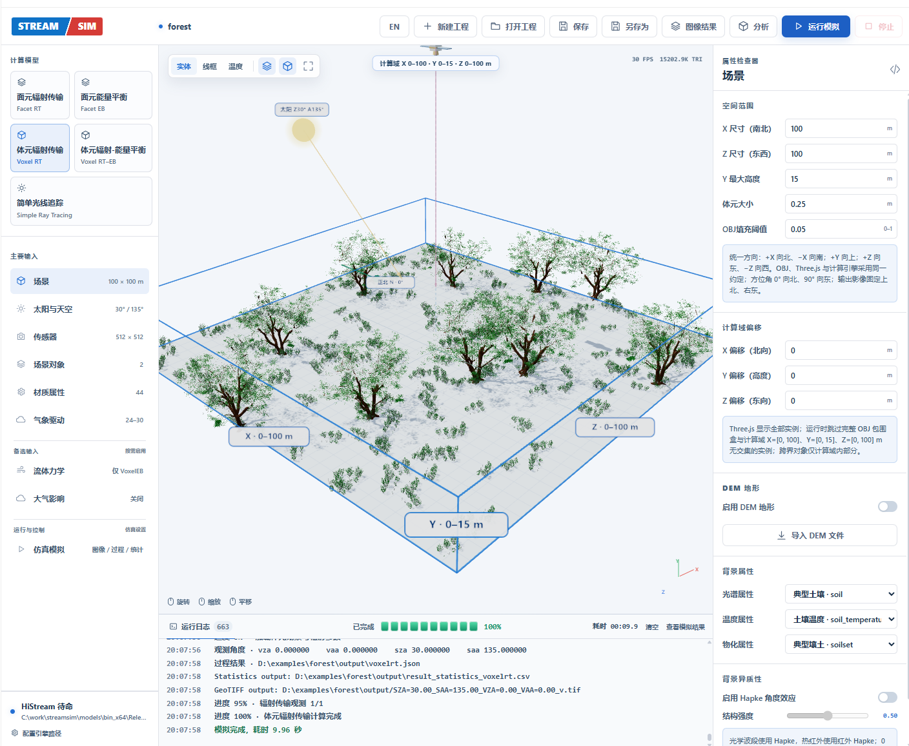
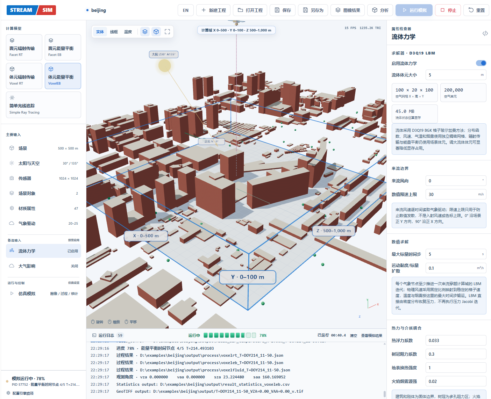
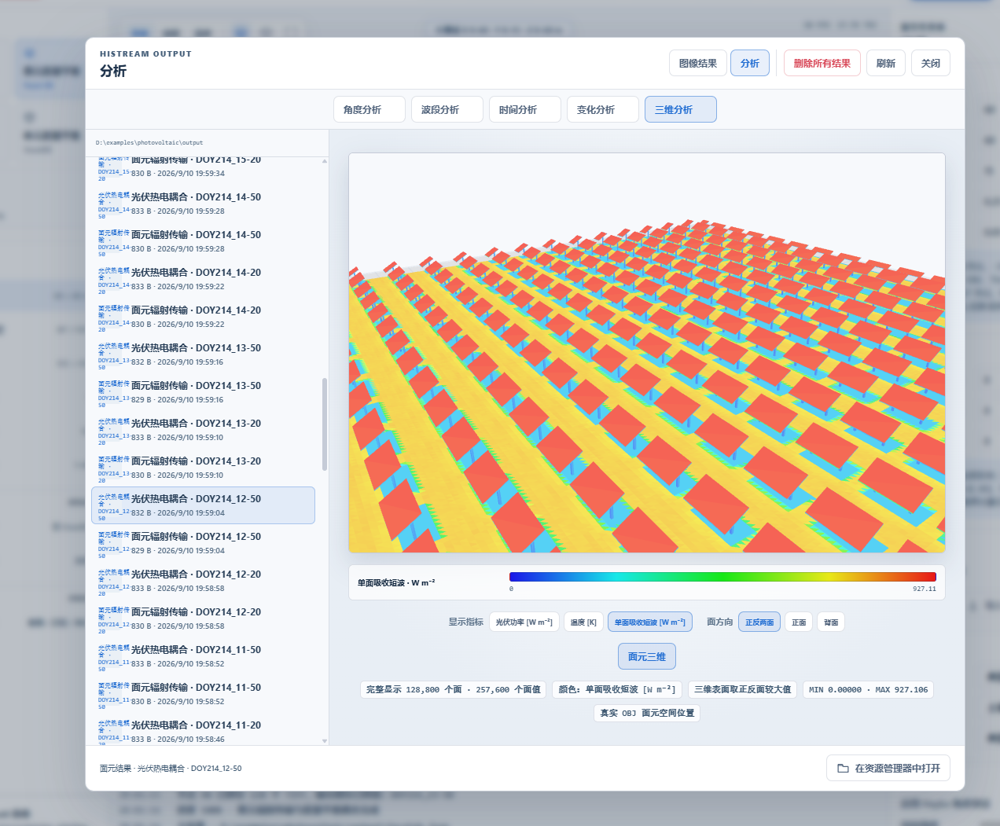
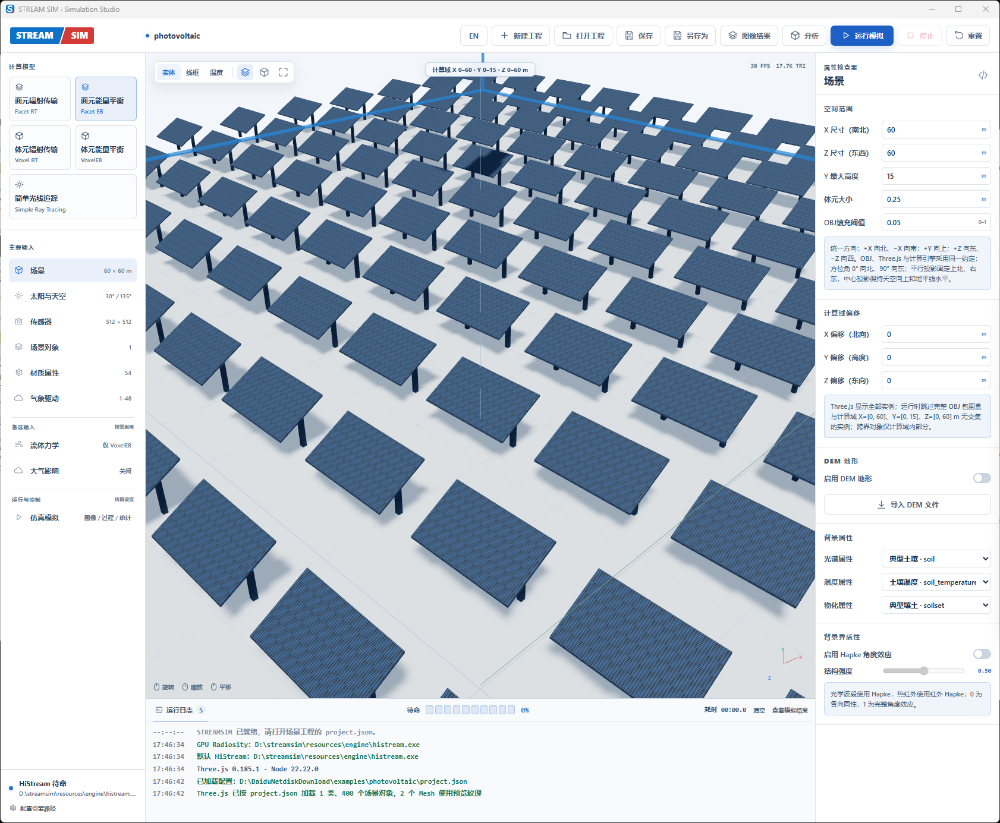
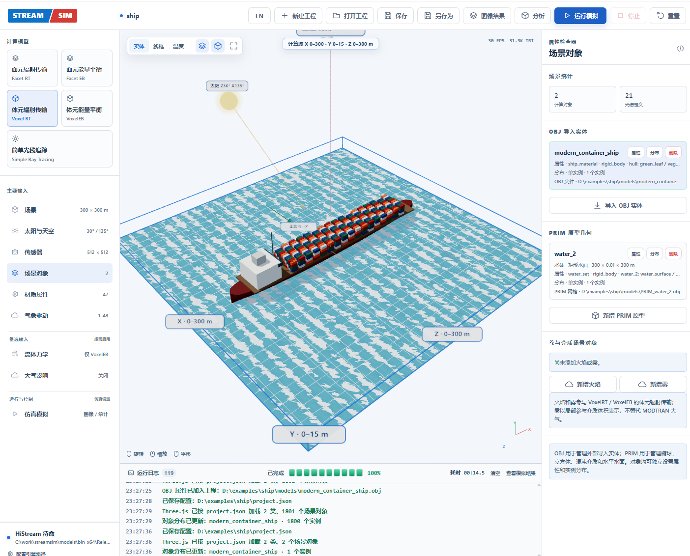
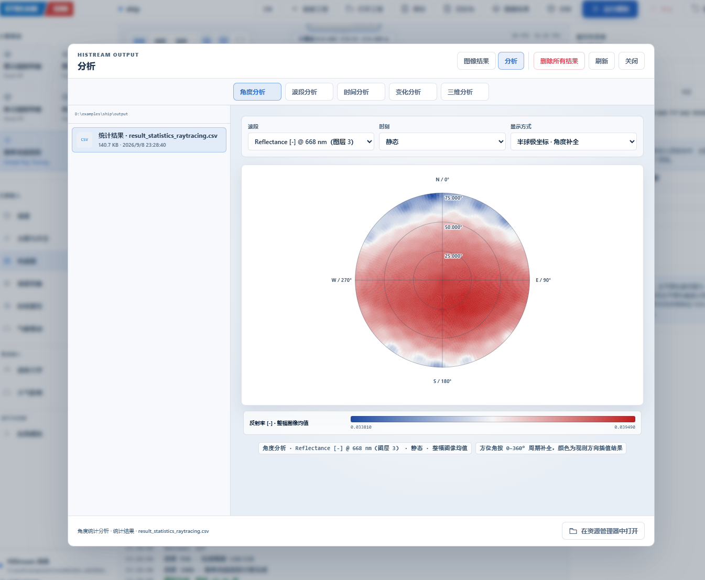

# StreamSim

StreamSim 是调用本地辐射传输模型的 Web GUI。源码、编译结果和运行文件均集中在本项目目录。

## 结果展示

<table>
  <tr>
    <td width="50%" align="center">
      <br>
      <strong>森林场景构建与三维预览</strong>
    </td>
    <td width="50%" align="center">
      <br>
      <strong>城市建筑三维场景</strong>
    </td>
  </tr>
  <tr>
    <td width="50%" align="center">
      <br>
      <strong>作物场景表面温度分布</strong>
    </td>
    <td width="50%" align="center">
      <br>
      <strong>光伏阵列三维场景</strong>
    </td>
  </tr>
  <tr>
    <td width="50%" align="center">
      <br>
      <strong>船舶与海面场景</strong>
    </td>
    <td width="50%" align="center">
      <br>
      <strong>热红外角度效应</strong>
    </td>
  </tr>
</table>

## 1.1 重点：异质性体元

StreamSim 1.1 着重完善了异质性体元工作。传统均质体元只给每个体元一种平均介质属性，网格变粗后容易丢失树叶聚集、枝叶空隙、建筑—植被交错和不同地物重叠形成的方向遮挡。异质性体元在体元化阶段回到原始 OBJ 三角面，对每个有效体元一次性提取真实结构统计量：

- 叶面积/结构体密度 `rho`，描述体元中“有多少结构”；
- X、Y、Z 三个方向的聚集指数 `CIx/CIy/CIz`，描述结构“如何排列和遮挡”；
- 最重要的两个地物类别及其遮挡贡献权重，用于综合光谱、温度与物化属性。

正式 VoxelRT/VoxelEB 求解时不再逐面追踪体元内部几何，而是根据射线方向组合三轴聚集指数，并以 `rho × G × CI(direction)` 进入消光、直射、天空漫射、多次散射和热辐射计算。这样既保留粗体元内部的方向异质性，又维持体元方法适合森林、作物和城市大场景的计算规模。该功能可在“仿真控制 → 异质性体元”中启用；均匀或低细节场景可关闭以减少预处理时间。

详细算法、适用边界和验证方法见[模型理论手册：异质性体元](docs/theory-manual.md#6-异质性体元11-重点)。

```text
streamsim/
├─ src/renderer/                GUI 源码
├─ gui/                         GUI 编译结果
├─ server.mjs                   Node 后端桥接
├─ assets/                      内置 OBJ、DEM、光谱和大气数据
├─ build/histream/              HiStream CMake 中间文件
├─ models/
│  ├─ histream/                 HiStream 源码、shader 和属性库
│  ├─ bin_x64/Release/          HiStream Release 编译结果
│  ├─ bin_x64/Debug/            HiStream Debug 编译结果
│  └─ nvpro_core/               HiStream 公共 C++ 依赖源码
├─ runtime/                     运行期资源和日志
└─ tools/                       构建、测试和数据生成脚本
```

启动：

```powershell
cd C:\work\streamsim
npm install
npm run build:gui
npm start
```

浏览器打开 `http://127.0.0.1:4173`。

文档：

- [模型使用手册](docs/user-manual.md)
- [模型理论手册](docs/theory-manual.md)

统一构建：

```powershell
npm run build:all
```

`build:all` 先编译 GUI，再编译 Release 引擎。CMake 优先使用环境变量 `VCPKG_ROOT`，未设置时会查找项目同级的 `vcpkg` 目录。

模型重新编译入口：

- `models/histream/CMakeLists.txt`
- `models/histream/src/main.cpp`
- `models/histream/src/base/engine.cpp`
- `models/histream/src/facetrt/`（Facetrt、FacetrtIO、Vulkan 核心）
- `models/histream/src/faceteb/`（Faceteb、FacetebIO）
- `models/histream/shader/facetrt/`
- `models/histream/shader/faceteb/`

CMake 编译仍需要本机 Vulkan SDK、Visual Studio 和 vcpkg 依赖。`eFacetRT` 和 `eFacetEB` 现在统一由 `histream.exe` 调用，分别加载 `shader/facetrt` 和 `shader/faceteb`；运行时不再调用独立 `radiosity_web_runner.exe`。

## 主要参考文献

1. Bian, Z., et al. (2017). Modeling the Temporal Variability of Thermal Emissions From Row-Planted Scenes Using a Radiosity and Energy Budget Method. *IEEE Transactions on Geoscience and Remote Sensing*. [DOI: 10.1109/TGRS.2017.2719098](https://doi.org/10.1109/TGRS.2017.2719098)
2. Bian, Z., et al. (2018). Modeling the Distributions of Brightness Temperatures of a Cropland Scene Using the Radiosity and Energy Budget Methods. *Remote Sensing*, 10(5), 736. [DOI: 10.3390/rs10050736](https://doi.org/10.3390/rs10050736)
3. Bian, Z., et al. (2020). Modeling the Directional Anisotropy of Fine-Scale TIR Emissions Over Tree and Crop Canopies Based on UAV Measurements. *Remote Sensing of Environment*, 252, 112150. [DOI: 10.1016/j.rse.2020.112150](https://doi.org/10.1016/j.rse.2020.112150)
4. 卞尊健等（2021）. 光学遥感三维计算机模拟模型的研究进展与应用. *遥感学报*. [DOI: 10.11834/jrs.20219274](https://doi.org/10.11834/jrs.20219274)
5. Bian, Z., et al. (2022). A GPU-Based Solution for Ray Tracing 3-D Radiative Transfer Model of Complex Land Surface Scenes. *IEEE Geoscience and Remote Sensing Letters*. [DOI: 10.1109/LGRS.2022.3206312](https://doi.org/10.1109/LGRS.2022.3206312)
6. Fan, M., et al. (2024). Modeling the Topographic Effect on Directional Anisotropies of Land Surface Temperature. *Journal of Remote Sensing*. [DOI: 10.34133/remotesensing.0226](https://doi.org/10.34133/remotesensing.0226)
7. Fan, M., et al. (2025). STREAM: A System for Tracing Radiative Transfer and Energy Balance in Three-Dimensional Land Surface Scenes. *International Journal of Applied Earth Observation and Geoinformation*, 104763. [DOI: 10.1016/j.jag.2025.104763](https://doi.org/10.1016/j.jag.2025.104763)
8. Bian, Z., et al. (2025). Evaluation of Three Modeling Frameworks of Thermal Infrared Radiative Transfer for Directional Anisotropies of Temperatures. *IEEE Transactions on Geoscience and Remote Sensing*, 63, 5001315. [DOI: 10.1109/TGRS.2025.3530503](https://doi.org/10.1109/TGRS.2025.3530503)

完整理论说明和分章节参考文献见[模型理论手册](docs/theory-manual.md)。

## 许可证 / License

本项目采用 [PolyForm Noncommercial License 1.0.0](LICENSE)。允许依照许可证进行非商业使用、修改和分发；任何商业使用均须事先取得许可方的单独书面授权。

This project is licensed under the [PolyForm Noncommercial License 1.0.0](LICENSE). Noncommercial use, modification, and distribution are permitted under its terms. Commercial use requires a separate prior written license from the licensor.
